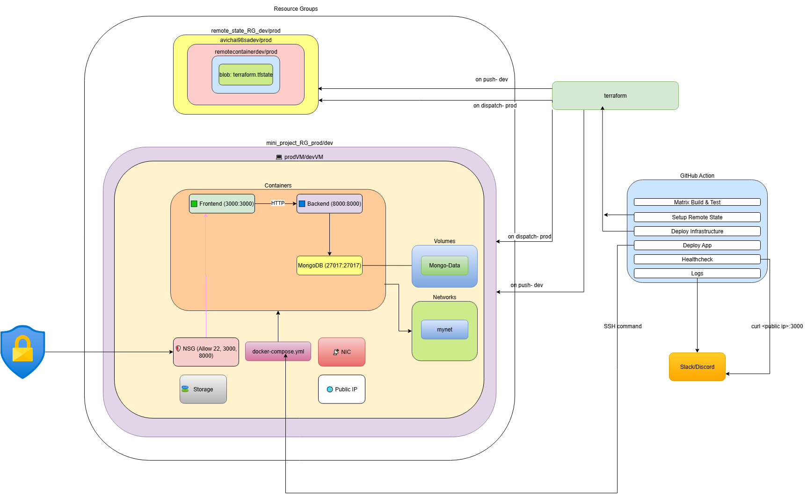
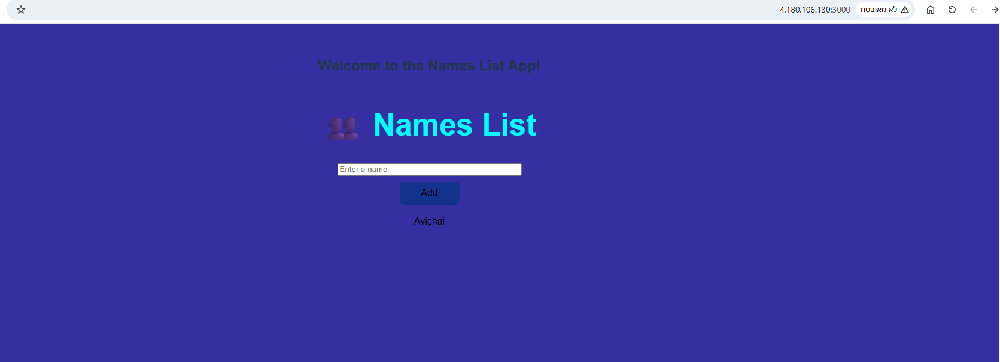

# Week 10 Final DevOps Project - Fullstack App Deployment on Azure

## Overview

This project demonstrates a complete DevOps pipeline for deploying a fullstack web application to Azure. The system is modular, containerized, and provisioned using infrastructure-as-code. CI/CD automation ensures consistent deployment, testing, and delivery.

The stack includes:
- A **React (Vite)** frontend
- A **Python backend** (Flask)
- A **MongoDB database**
- Container orchestration using **Docker Compose**
- Provisioning via **Terraform**
- Deployment via **GitHub Actions**

---

## Architecture Diagram



The diagram illustrates:
- Azure Virtual Machine and networking
- Docker containers for frontend, backend, and MongoDB
- CI/CD pipeline from GitHub Actions to Azure
- Terraform provisioning (bootstrap, modules, environments)
- Volumes for persistent data and logs

---

## Tech Stack

- **Frontend:** React (with Vite)
- **Backend:** Python (Flask)
- **Database:** MongoDB
- **Containerization:** Docker, Docker Compose
- **CI/CD:** GitHub Actions
- **Infrastructure:** Terraform
- **Cloud Provider:** Microsoft Azure

---

## Project Structure

```
├── app/                  
│   ├── frontend/             # React + Vite frontend application
│   │   └── Dockerfile        # Frontend service image
│   ├── backend/              # Python backend application
│   │   └── Dockerfile        # Backend service image
│   └── docker-compose.yaml   # Orchestrates all services
├── infrastructure/
│   ├── bootstrap/            # Remote backend provisioning (state storage)
│   │   ├── dev/
│   │   └── prod/
│   ├── dev/                  # Terraform for dev environment
│   ├── prod/                 # Terraform for prod environment
│   └── modules/              # Reusable infrastructure modules
│       ├── network/
│       ├── resource_group/
│       └── virtual_machine/
├── .github/workflows/        # GitHub Actions workflows
│   ├── backend-test.yml
│   ├── cicd.yml
│   ├── deploy-app.yml
│   ├── docker-build-backend.yml
│   ├── docker-build-frontend.yml
│   ├── frontend-test.yml
│   ├── notify-backend.yml
│   ├── notify-frontend.yml
│   ├── terraform-remote-state.yml
│   └── terraform.yml
├── scripts/
│   ├── healthcheck.sh
│   └── deployment.sh         # Bash script for VM deploy application
├── deployment_log.md         # CLI command history
├── application_running.png   # Screenshot of running app
└── README.md
```

---

## Environment Separation Strategy

Folder-based separation is used for provisioning isolated dev and prod environments. Shared modules are used for networking, VMs, and resource groups. A dedicated `bootstrap/` folder provisions a remote backend (Azure Blob) to maintain Terraform state.

---

## Docker Setup

Docker Compose defines the following services:
- `frontend`: React (Vite) served on port 3000
- `backend`: Flask API served on port 8000
- `mongodb`: MongoDB container with persistent volume

A custom bridge network handles internal service communication. Logs and data are stored using mounted volumes.

---

## CI/CD with GitHub Actions

Modular workflows automate testing, building, provisioning, and deployment:

| Workflow File | Description |
|---------------|-------------|
| `backend-test.yml` | Run backend unit tests using `pytest` |
| `frontend-test.yml` | Run frontend tests and linting |
| `docker-build-backend.yml` | Build and push backend Docker image |
| `docker-build-frontend.yml` | Build and push frontend Docker image |
| `terraform-remote-state.yml` | Bootstrap the remote state backend |
| `terraform.yml` | Deploy full environment using modules |
| `deploy-app.yml` | SSH into VM, pull app, and start containers |
| `notify-backend.yml` | Notify channel after backend deployment |
| `notify-frontend.yml` | Notify after frontend deployment |
| `cicd.yml` | Combined orchestrator |

Secrets and matrix strategies are used where applicable.

---

## Infrastructure Provisioning with Terraform

```bash
# Step 1: Bootstrap remote state
cd infrastructure/bootstrap/dev
terraform init
terraform apply

# Step 2: Provision infrastructure
cd ../../dev
terraform init
terraform apply
```

Key resources provisioned:
- Azure Resource Group
- Virtual Network, Subnet, Public IP
- Network Security Group (NSG) with port rules for 22 (SSH), 3000 (frontend), 8000 (backend)
- Virtual Machine (Linux)
- Remote backend for Terraform state

### Network Security Group (NSG)

A custom NSG was provisioned using a reusable module in Terraform. The security group includes explicit rules to allow only the required inbound traffic:

- **Port 22** for SSH access
- **Port 3000** for the frontend service (React)
- **Port 8000** for the backend service (Flask)

The NSG is attached to the VM's network interface using `azurerm_network_interface_security_group_association`. All rules follow the principle of least privilege, and are defined in `infrastructure/modules/network/`.

Each rule is created via `security_rule` blocks inside the NSG resource.

---

## Virtual Machine Setup

After provisioning, the VM is configured with Docker and Docker Compose using the `scripts/deployment.sh` Bash script. This setup ensures the app can be deployed via SSH or CI/CD runners.

---

## Healthcheck and Resilience

A healthcheck is configured in `docker-compose.yaml` for the backend. Restart policies ensure service availability after VM reboot or failure.

---

## Automation Scripts

- `deployment.sh`: installs Docker, pulls code, and starts containers
- `healthcheck.sh`: verifies service responsiveness using `curl`

---

## Application Preview



Accessible at:
```
http://<your-azure-vm-ip>
```

---

## How to Run Locally

```bash
git clone https://github.com/Avichai98/mini-project-week10.git
cd app
docker compose up --build

# Frontend: http://localhost:3000
# Backend:  http://localhost:8000
```

---

## Logs and Monitoring

Service logs are stored using Docker volumes. MongoDB data is persisted across reboots. Logs can optionally be redirected to Azure File Storage or sent to third-party services.

---